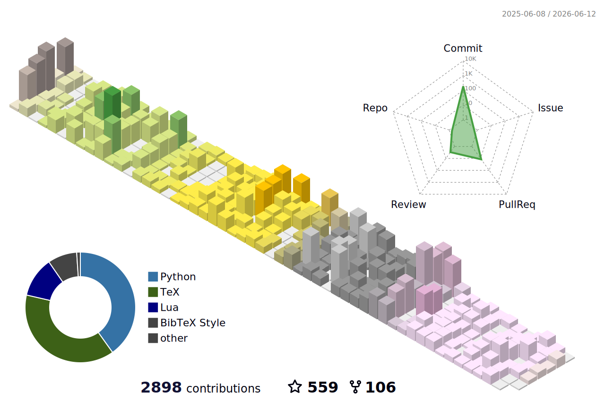

### Hi there 👋

Do not email me, I maybe slow to respond. Creating issues or discussions instead.

<a href="https://haiiliin/"><!-- wi*quL3fcV --></a>

### :zap: Recent Activity

<!--START_SECTION:activity-->
1. 🚀 Published release [v1.4.3.post1 (No type dependencies)](https://github.com/haiiliin/binder/releases/tag/v1.4.3.post1) in [haiiliin/binder](https://github.com/haiiliin/binder)
2. 🗣 Commented on [#341](https://github.com/RosettaCommons/binder/pull/341#issuecomment-4321985359) in [RosettaCommons/binder](https://github.com/RosettaCommons/binder)
3. ❌ Reopened PR [#341](undefined) in [RosettaCommons/binder](https://github.com/RosettaCommons/binder)
4. ❌ Closed PR [#341](undefined) in [RosettaCommons/binder](https://github.com/RosettaCommons/binder)
5. 💪 Opened PR [#341](undefined) in [RosettaCommons/binder](https://github.com/RosettaCommons/binder)
<!--END_SECTION:activity-->
